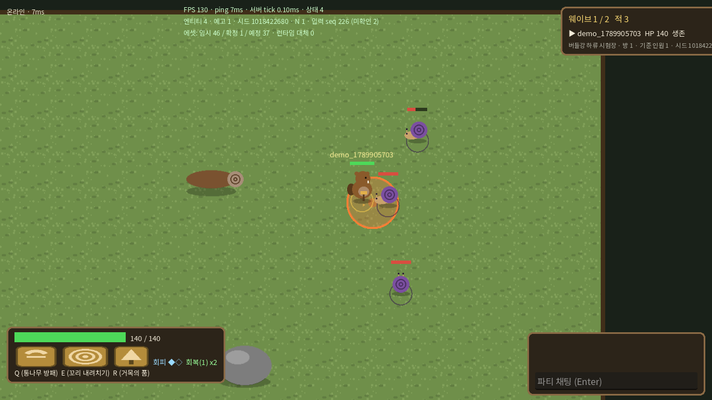

# 꼬리원정대: 검은 물결 (Tail Expedition: Black Tide)

비버 주인공의 **1~4인 온라인 협동 로그라이크 RPG**. 설치형 PC 클라이언트가 상시 실행되는 **전용 서버**에 접속한다. 특정 플레이어의 초대나 접속에 의존하지 않고, 공용 마을은 서버가 소유·저장한다.

현재 상태: **단계 0(골격)·단계 1(전용 서버·영구 월드·4인 전투 기반)** 구현. 임시 도형 에셋 사용. 자세한 범위와 제한은 아래와 `docs/verification.md` 참고.



## 구성
```
project.godot / main.tscn / boot.gd   서버·클라이언트·도구 공용 진입점
shared/      프로토콜, RPC 창구, 콘텐츠 DB, 판정 수학
server/      전용 서버 (인증, JSON 저장소, 공용 마을, 원정 인스턴스, 전투방 시뮬레이션)
client/      설치형 클라이언트 (접속/로그인/마을/원정 모집판/전투 HUD/결과, 예측·보간, 봇 모드)
data/        직업·적·방·인원 프로필·규칙 JSON (숫자는 여기서만 조절)
assets/      asset_manifest.json(ID↔파일), asset_registry.gd, placeholders/(임시), fonts/(Noto Sans KR, OFL)
tools/       lint_all, run_tests, check_assets, gen_placeholders
tests/       integration/run_integration.sh (서버 + 다중 headless 클라이언트)
scripts/     run_server.sh, run_client.sh, build.sh, deploy.sh, stop_server.sh, backup/restore, systemd 유닛
docs/        architecture.md, asset_plan.md, verification.md, deploy.md
```

## 요구 사항
- Godot **4.4.1 stable** (편집기 바이너리). 빌드에는 같은 버전의 export templates.
- 서버: Windows 또는 Linux(x86_64). 클라이언트: Windows(주 대상), Linux.

## 개발용 실행
```bash
# 최초 1회: 클래스 캐시·임포트
godot --headless --path . --import
# 전용 서버 (기본 포트 7777, 데이터는 user://server_data)
scripts/run_server.sh --port=7777 --data-dir=./server_data --log-level=info
# 클라이언트 (창 필요). 접속 화면에서 127.0.0.1:7777 입력 또는:
scripts/run_client.sh --connect=127.0.0.1:7777
```
같은 PC 에서 클라이언트를 여러 개 띄워 다른 닉네임으로 가입하면 4인 원정을 시험할 수 있다.

## 플레이 흐름
서버 주소 입력 → 계정 생성/로그인(서버 내부 계정, 이메일 불필요) → 공용 마을(WASD 이동, 채팅) → 원정 모집판에서 **새 원정 만들기** 또는 **참가**(최대 4명, 혼자도 가능) → 준비 완료 → 출정 → 전투방(수액 달팽이 2웨이브) → 결과 → 다시 도전 또는 마을로.

조작: WASD 이동, 마우스 조준, 좌클릭 기본 공격(나무망치), Space 회피(2충전), Q 통나무 방패, E 꼬리 내려치기, R 거목의 품, F 구조(다운된 아군 근처 3초 유지), 1 회복(원정당 2회), Enter 채팅, F3 개발 화면, F11 전체화면.

## 빌드·배포
```bash
scripts/build.sh all      # build/windows/TailExpedition.exe, build/linux-server/, build/windows-server/
```
GitHub Actions(`.github/workflows/build.yml`)가 push 마다 린트·에셋 검수·단위·통합 테스트를 돌리고, `v*` 태그에서 Windows 클라이언트 zip 과 서버 묶음을 Release 로 올린다. 서버 설치·운영은 `docs/deploy.md`.

## 테스트
```bash
# 화면 캡처 데모 (가상 디스플레이에서도 가능): 자동 가입→출정→결과 후 종료
xvfb-run -a godot --path . --rendering-driver opengl3 --rendering-method gl_compatibility -- --connect=127.0.0.1:7777 --demo=demo1 --shots=./shots
godot --headless --path . -- --tool=lint_all
godot --headless --path . -- --tool=check_assets
godot --headless --path . -- --tool=run_tests
tests/integration/run_integration.sh /path/to/godot
```

## 에셋 교체
모든 코드는 에셋 **ID** 만 참조한다. 최종 파일을 같은 규격으로 만들어 `asset_manifest.json` 의 `final_path` 에 연결하거나, 배포본 실행 파일 옆 `asset_overrides/<id>.png` 로 두면 재빌드 없이 교체된다. 절차와 규격은 `docs/asset_plan.md`.

## 단계 1 에서 구현된 것 / 아닌 것
구현: 전용 서버 독립 실행·설정 파일, 주소 접속·버전 검사, 계정 생성/로그인/재접속 토큰, 서버 정원과 원정 정원 분리, 접속자 0명·재시작 후에도 유지되는 공용 마을, 원정 모집판(공개 파티, 1~4인), 인원별 프로필 고정, 서버 판정 이동·공격·피격·회피·스킬(Q/E/R)·회복, 다운(25초)·구조(3초)·전멸·승리·재도전, 연결 끊김 유예(120초)와 같은 슬롯 복귀, 결과·영구 기록(기억 조각·직업 숙련·통계), 임시 에셋과 ID 분리, 단위·통합 테스트, export preset, CI, 운영 스크립트.

미구현(단계 2 이후): 나머지 4직업, 철턱 가재와 기믹, 유물·상점·이벤트·경로 선택, 목재·건설·수문, 마을 시설 복구 UI, 원정 이어하기 저장, DTLS 암호화, SQLite 저장소, 튜토리얼, 키 재설정 UI, BGM.
